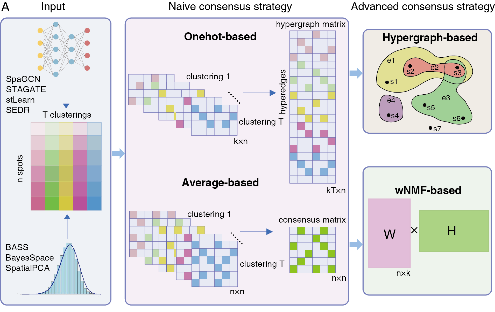
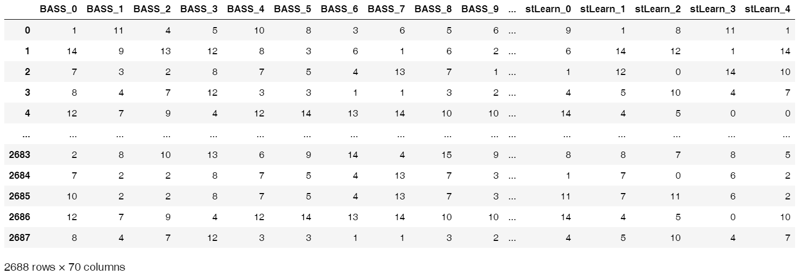

# STCC
consensus clustering enhances spatial domain detection for spatial transcriptomics data.

We developed STCC, a novel consensus  clustering framework for spatial transcriptomics data that aggregates outcomes from  state-of-the-art tools using a variety of consensus strategies, including Onehot-based,  Average-based, Hypergraph-based and wNMF-based methods. Below, we will introduce the steps in the following order: **software installation**, **data download**, **running baseline algorithms**, and **running STCC**. If you already have clustering results, you can skip the step of running baseline algorithms and proceed directly to running STCC.



# 1. Software installation

| Baseline Algorithms | Github/Link                                                  |
| ------------------- | ------------------------------------------------------------ |
| BASS                | https://www.rdocumentation.org/packages/BASS/versions/1.3.1  |
| BayesSpace          | https://www.bioconductor.org/packages/release/bioc/html/BayesSpace.html |
| SEDR                | https://github.com/JinmiaoChenLab/SEDR                       |
| SpaGCN              | https://github.com/jianhuupenn/SpaGCN/tree/master            |
| SpatialPCA          | https://github.com/shangll123/SpatialPCA                     |
| STAGATE             | https://github.com/zhanglabtools/STAGATE                     |
| stLearn             | https://stlearn.readthedocs.io/en/latest/                    |

You can install the corresponding software using the links provided above, or we have listed simple installation commands below for your reference.

**BASS**

```
install.packages("devtools")
devtools::install_github("lanl/BASS")
```

**BayesSpace**

```
if (!require("BiocManager", quietly = TRUE))
    install.packages("BiocManager")

BiocManager::install("BayesSpace")
```

**SpatialPCA**

```
library(devtools)
install_github("shangll123/SpatialPCA")
```

**SEDR**

The following packages are required to be able to run everything in this repository

```
python==3.11.3
torch==2.0.1
cudnn==12.1
numpy==1.24.3
scanpy==1.9.3
anndata==0.9.1
ryp2==3.5.12
pandas==2.0.1
scipy==1.10.1
scikit-learn==1.2.2
tqdm==4.65.0
matplotlib==3.7.1
seaborn==0.12.2
R==4.0.3
```

**SpaGCN**

```
# Create an environment
conda create --name SpaGCN python=3.7

# Activate Environment
conda activate SpaGCN

# Installing SpaGCN
pip install SpaGCN

# Install the following python packages
numpy==1.21.6
pandas==pandas
sklearn==1.0.2
scipy==1.7.3
scanpy==1.9.3
anndata==0.8.0
torch==1.13.1
rpy2==3.5.16
```

**STAGATE**

Before installing STAGATE, please download [STAGATE-main](https://github.com/zhanglabtools/STAGATE) first.

```
# Installing STAGATE
cd STAGATE-main

python setup.py build

python setup.py install

# Install the following python packages
scanpy==1.9.3
anndata==0.9.1
sklearn==1.2.2
tensorflow==1.15.0
```

**stLearn**

```
# Create an environment
conda create -n stlearn python=3.8

# Activate Environment
conda activate stlearn

# Installing stlearn

# 1.Install stlearn using anaconda
conda install -c conda-forge stlearn

# 2.Install stlearn using pip
pip install -U stlearn

# Install the following python packages
numpy==1.21.6
pandas==2.0.0
sklearn==1.9.3
scipy==1.9.1
scanpy== 1.9.3
anndata==0.9.1
pillow==9.4.0
```

**STCC**

```
# Create an environment
conda create --name STCC python=3.8

# Activate Environment
conda activate STCC

# Install STCC using pip
pip install STCC==1.0.2

# Install the following python packages
numpy==1.22.1
pandas==1.5.3
sklearn==0.0.post4
scipy==1.7.3
scanpy==1.9.6
anndata==0.8.0
squidpy==1.2.3
cvxopt==1.3.1
```

# 2. Data download

The processed data and manual annotations for STARmap data (Wang et al.  2018) across three consecutive sections of the mouse cortex are available at:  https://github.com/zhengli09/BASS-Analysis/tree/master/data.

# 3. Running baseline algorithms

If you already have clustering results, you can skip this step and proceed directly to step 4, "Running STCC." It is important to note that the input for STCC is a matrix composed of label vectors of different clustering results, where **the rows represent spots** and **the columns represent the indices of different clustering results**, as shown in the figure below.

```
df = pd.read_csv('STCC/test data.csv',index_col=0)
```



Below, we provide the code for running the baseline algorithms.

* [Analysis of Mouse mPFC data with `BASS`](https://github.com/hucongcong97/STCC/tree/main/tutorial/RUN_BASS.R)

* [Analysis of Mouse mPFC data with `BayesSpace`](https://github.com/hucongcong97/STCC/tree/main/tutorial/RUN_BayesSpace.R)
* [Analysis of Mouse mPFC data with `SEDR`](https://github.com/hucongcong97/STCC/tree/main/tutorial/RUN_SEDR.py)
* [Analysis of Mouse mPFC data with `SpaGCN`](https://github.com/hucongcong97/STCC/tree/main/tutorial/RUN_SpaGCN.ipynb)
* [Analysis of Mouse mPFC data with `SpatialPCA`](https://github.com/hucongcong97/STCC/tree/main/tutorial/RUN_SpatialPCA.R)
* [Analysis of Mouse mPFC data with `STAGATE`](https://github.com/hucongcong97/STCC/tree/main/tutorial/RUN_STAGATE.ipynb)

# 4. Running STCC

Use STCC to integrate the results of the above baseline algorithms.

* [Tutorial](https://github.com/hucongcong97/STCC/tree/main/tutorial/RUN_STCC.ipynb)

