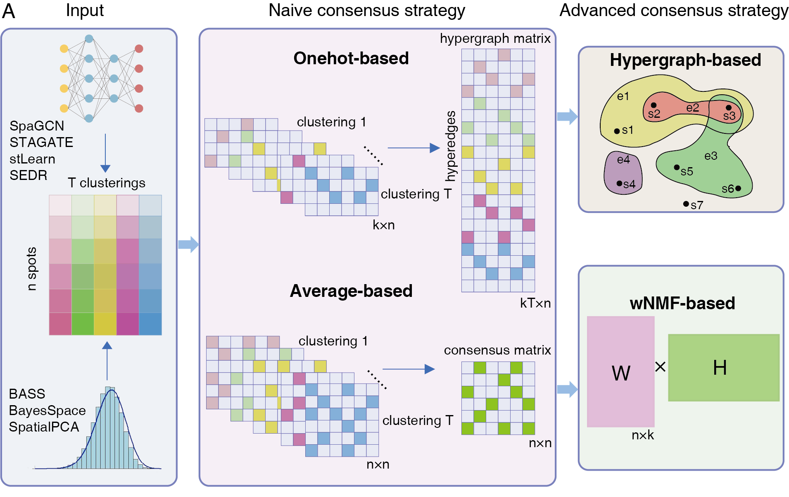
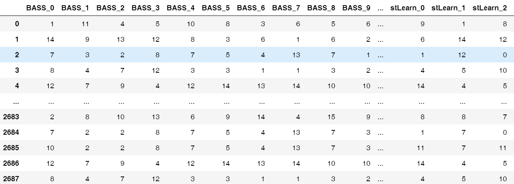

# STCC
consensus clustering enhances spatial domain detection for spatial transcriptomics data



# 1. Installing Environment

```
conda env create -f STCC.yaml
```

# 2. Data preparation

The input of STCC is a matrix composed of label vectors of different clustering results, where **the rows represent spots** and **the columns represent the indices of different clustering results**.

```
df = pd.read_csv('test data.csv',index_col=0)
```



# 3. Running STCC

```
n_clusters = 12   # true number of categories
method = 'Averaged-based' # 'Onehot-based','NMF-based','wNMF-based'
seed = 2024 # random seed
labels_consensus = consensus_summary(df,n_clusters,methods=method,seed=seed)
```

